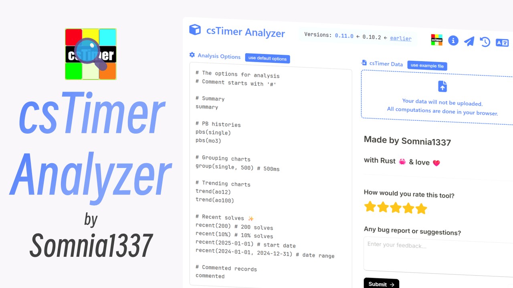

English | [中文](https://github.com/Somnia1337/csTimer-Analyzer-web/blob/main/README-ZH.md)

## [csTimer-Analyzer-web](https://somnia1337.github.io/csTimer-Analyzer-web/)

The web app for [csTimer-Analyzer](https://github.com/Somnia1337/csTimer-Analyzer), leveraging the power of [WebAssembly](https://developer.mozilla.org/en-US/docs/WebAssembly) and the [Rust](https://www.rust-lang.org) toolchain.

<div align=center>
  
</div>

Features:

- **SECURE**. Your data will not be uploaded, all computations are done in your browser(thanks to WebAssembly).
- **FAST**. It can read and analyze thousands of records in under a second.
- **CONFIGURABLE**. The analyzer reads your configuration from the web app's textarea, making it simple to use.
- **FLEXIBLE**. It generates and renders a markdown document as the analysis report, so you can read it right in your browser.

### Usage

1. Go to [csTimer](https://www.cstimer.net/), click on the "EXPORT" button, then click "Export to file". A data file named `cstimer_YYYYMMDD_hhmmss.txt` should be downloaded.
2. Open [csTimer-Analyzer-web](https://somnia1337.github.io/csTimer-Analyzer-web/), write your analysis options in the textarea, see below for configuration tutorials.
3. Press the file selection button and choose the data file you just downloaded, your browser should begin analyzing automatically and show the report afterwards.

### Analysis Options

The analyzer reads your options from the textarea, here's how to write it.

- `summary`: Provides an summary of a session, including best and worst times, mean and average, and counts of `+2`s and `DNF`s.
- `stats`: The metric of statistics, choose one of these:
  - `single`: single solves
  - `mo{n}`: mean of `n` solves
  - `ao{n}`: average of `n` solves
- `pbs(stats)`: Tracks your personal best history for `stats` over time.
- `group(stats, millis)`: Groups `stats` into intervals of `millis` milliseconds, producing a histogram.
- `trend(stats)`: Tracks the trend of `stats`, generating a trend chart.
- `commented`: Filters records with a comment(maybe useful if you comment when skipping OLL/PLL).

Check below for a real example of options.

```text
# The options for analysis

# Comment starts with '#'

# Summary
summary

# Pb histories
pbs(single)
pbs(mo3)

# Grouping charts
group(single, 500) # 500ms

# Trending charts
trend(ao12)
trend(ao100)

# ✨ NEW ✨ Recent solves
recent(200)                    # 200 solves
recent(10%)                    # 10% solves
recent(2025-01-01)             # start date
recent(2024-01-01, 2024-12-31) # date range

# Commented records
commented
```

### Todo

- feat: treat `StatsScale` 0 as "auto".
- test: add test modules.
